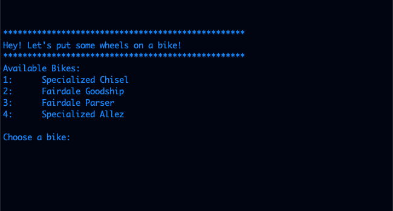
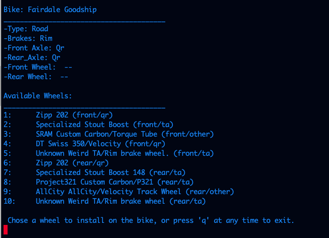
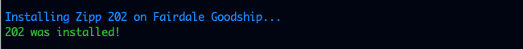
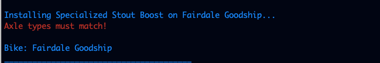
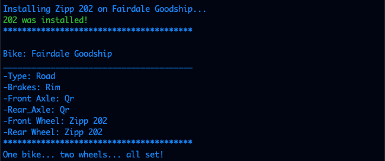

# Put A Wheel On It!
### Overview:
This is a simple API created with Python 3.8.4 Django 3.1.5 and Django REST Framework 3.12.2. It exposes bike and wheel objects.  By utilizing a PUT/PATCH endpoint you can add a front wheel and rear wheel to a bike object.

### Setup:

__ITS ALIVE!__:  _As of 1/25/21 this api now lives on AWS Elastic Beanstalk.  The CLI will require setup, but after requirements are installed it will run._

Python is required, and you don't have it, you can get a version of it [here](https://www.python.org/downloads/).

While not "required" I highly suggest adding an alias for 'python manage.py...' as you will be running that quite a lot in Django/DRF.  I use the alias `pym` and will refer to it below.  To add an alias, open your bash/zsh profile and add the following:

`alias pym="python3 manage.py"`

Create a new project directory and CD into it with the following command:

`mkdir bike && cd bike`

Clone the project:

`git clone git@github.com:mikez321/bike.git`

Create a virtual environment:

`python3 -m venv env`

Activate it:

`source env/bin/activate`

Install necessary packages using the provided requirements.txt.  For help with Python packages, go [here](https://packaging.python.org/tutorials/installing-packages/):

`pip install -r requirements.txt`

The following packages will now be installed:

```
appnope==0.1.2
asgiref==3.3.1
attrs==20.3.0
backcall==0.2.0
certifi==2020.12.5
chardet==4.0.0
decorator==4.4.2
Django==3.1.5
djangorestframework==3.12.2
idna==2.10
iniconfig==1.1.1
ipython==7.19.0
ipython-genutils==0.2.0
jedi==0.18.0
packaging==20.8
parso==0.8.1
pexpect==4.8.0
pickleshare==0.7.5
pluggy==0.13.1
prompt-toolkit==3.0.10
ptyprocess==0.7.0
py==1.10.0
Pygments==2.7.4
pyparsing==2.4.7
python-dotenv==0.15.0
pytz==2020.5
requests==2.25.1
sqlparse==0.4.1
termcolor==1.1.0
toml==0.10.2
traitlets==5.0.5
urllib3==1.26.2
wcwidth==0.2.5
```

_As mentioned above, at this point you should have gone through enough setup to run the CLI, but you've come this far, so might as well finish right?_

Of note will be Django and Django REST framework, but also `python-dotenv` which is used to hide secrets and `ipython` which is an incredibly helpful debugging tool.

Create a `.env` file to hold your django SECRET_KEY (which is found in settings.py) with touch:

`touch.env`

You can now copy the django SECRET_KEY found in settings.py into .env as:

```
SECRET_KEY=<your_secret_key_goes_here>
```

And then reference it in your code with:

`os.getenv(<whatver you want out of .env>)`

You should be able to start up your django server at this point using the following command:

`pym runserver`

Open a browser, navigate to `localhost:8000` and you should see the Django Rocket!  Yay!  You're part of the way there! :rocket:

There's a seed file included to get you rolling with some bikes and some wheels.  But first migrate your database:

`pym migrate`

Populate the seed data:

`pym loaddata db_seed.json`

Make a user for yourself to access the Django admin at `localhost:8000/admin`:

`pym createsuperuser`

And at this point you should be pretty set!


### File Structure/Layout:
The basic layout of the app is as follows:
```
.
├── Makefile
├── README.md
├── api
│   ├── settings.py
│   ├── urls.py
├── bike
│   ├── admin.py
│   ├── apps.py
│   ├── migrations
│   ├── models.py
│   ├── serializers.py
│   └── views.py
├── cli
│   ├── apiconnector.py
│   ├── bike.py
│   ├── bikefetcher.py
│   ├── cli.py
│   ├── wheel.py
│   ├── wheelfetcher.py
│   └── wheelinstaller.py
├── db_seed.json
├── manage.py
├── requirements.txt
└── wheel
    ├── admin.py
    ├── migrations
    ├── models.py
    ├── serializers.py
    └── views.py
```
__api__: This is the main application which holds the overall urls.py and settings for the application.  It is named API because... well the app is an API!

__bike__: The bike app contains everything bike-related.  Here you can find bike models, serializers, and viewsets.  All tests for bike-related things can be found in the test folder, and migrations for bike models will be housed in the migrations folder.

__wheel__: The wheel app is to wheels as bike is to bikes.  However, since we've got front and rear wheels, there are separate models for each which inherit from a generic wheel model.

__cli__: A command line tool used to interact with the api.


### Testing
All models, serializers, and views are tested for happy path and a few sad-paths in serializers.  Custom validators ensure bikes can only accept wheels with matching axles and brakes (very generally).  Also, with the help of built-in Django validators, front wheels can only be accepted on the front wheel area of a bike (fork), and rear wheels can only go in the back.

CLI tools are also tested.  The CLI creates bike and wheel objects from information gathered from the API.  All models and model methods are tested in the CLI.

Testing for the API can be run with `pym test`.  There are currently 22 tests.  As the CLI is an included add-on, it is not part of the app and individual unittest tests are written and live in the CLI folder.  They can be run individually with `python3 <test_name>.py`.


### Endpoints
__Bike__:  Bikes use Django ModelViewSets, and therefore have full CRUD functionalty.  They are accessed through `/bikes/` REST endpoints.

`GET /bikes/` returns all bikes in the database.

`GET /bikes/1` returns only information on bike with a primary key of 1.

`POST /bikes/` will create a new bike.

`PUT/PATCH /bikes/1` allows updates to bike with pk of 1.

`DELETE /bikes/1` will delete the bike.

__Wheel__:  Wheel objects have less open access than bikes and use ViewSets as well as hand-rolled APIViews for their endpoints.

`GET /wheels/` is a custom, hand-rolled endpoint which returns all types of wheel objects (FrontWheels and RearWheels) shown with minimal information.

`GET /wheels/front` is a list of all front wheels

`GET /wheels/rear` is a list of all rear wheels

`GET /wheels/(front/rear)/<pk>` will return whatever combo of front/rear wheel and its PK.


### CLI Tool
Included in the project is a command line tool for interacting with the API.  It is broken up into different modules for accessing different parts of the API like bikes and wheels, and has a dedicated ApiConnector module used to change the endpoints of the API in a single place.  For convenience, it is executed by a small script located in a Makefile at the root of the project.

After the project is set up, you can start a server with:

`pym runserver`

And then in a new terminal window/tab simply run the makefile by typing:

`make`

The makefile will run `python3 cli/cli.py` and start the CLI tool.  From here you can interact with the API and enjoy all validations written for wheels and bikes in real-time.  Changes will be made to the local database and can be undone through the admin console.  The CLI will automatically set front and rear wheels so you don't have to worry about installing a front wheel in the back or vice-versa.

__Using the CLI:__

Running the CLI will present the following screen.  Bikes are pulled from the API and displayed.



After a bike is selected, it will be displayed on the screen with some basic info.  A list of wheels will also be displayed.



Choosing a wheel will install it on the bike.  A 1 second pause has been added for an improved user experience.  Choosing a wheel with the correct combo of axle and brake for the selected bike will result in a positive message and the wheel will be installed.



And if the combo is not compatible, the error produced by the API is returned.



Finally, when two successful wheels have been added to a bike.  The program will show the bike with wheels added and will exit.


